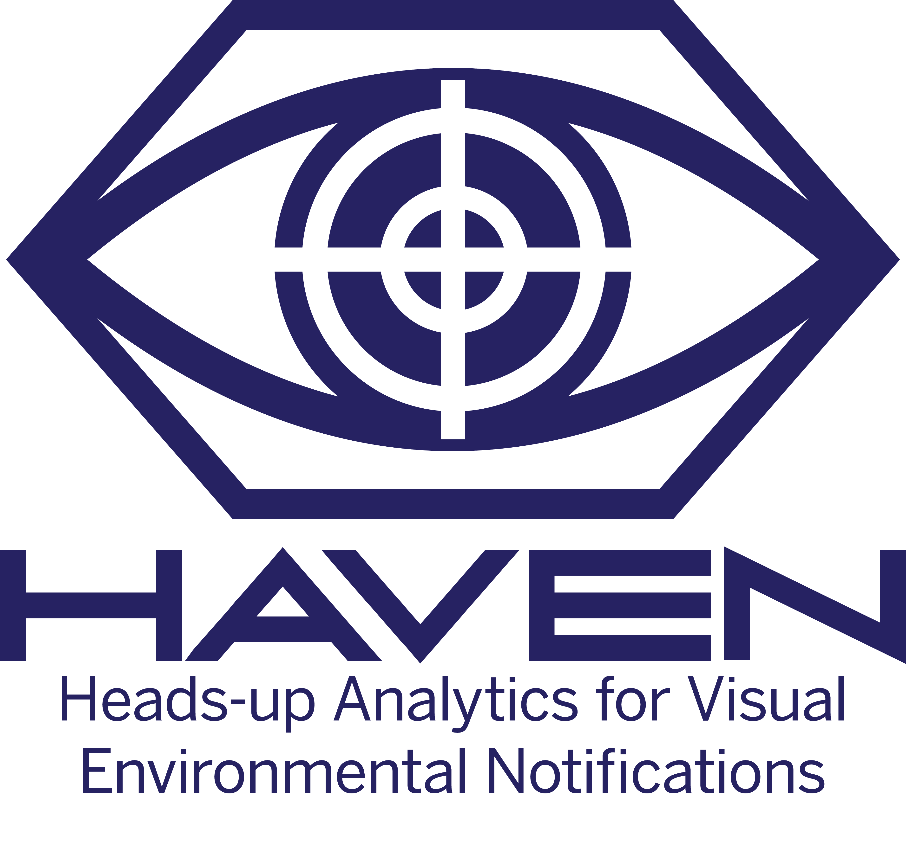

<p align="center">
  
</p>

# HAVEN System  
**Heads-up Analytics for Visual Environmental Notifications**

HAVEN is an AI-powered surveillance prototype that simulates AR smart-glasses functionality using a phone or desktop webcam. It performs real-time facial recognition, license plate OCR, and behavior analysis, overlaying results in a heads-up display (HUD) and logging them for post-analysis.

---

## Features

- Face Recognition
  Watchlist-based face matching using OpenCV histograms.

- License Plate OCR  
  YOLOv8 object detection with Tesseract OCR for text extraction.

- Behavior Detection  
  Loitering and erratic movement detection using motion heuristics.

- AR-Style HUD  
  Overlay system that draws bounding boxes, IDs, and real-time alerts.

- Logging and Summary Reports  
  Events are logged to a CSV file and summarized in a text report.

- Dashboard  
  Optional Streamlit interface to visualize logs and review input footage.

---

## Technology Stack

| Component         | Library / Tool             |
|------------------|----------------------------|
| Face Detection    | OpenCV Haar Cascade        |
| Plate Detection   | YOLOv8 (Ultralytics)       |
| OCR               | Tesseract                  |
| HUD Rendering     | OpenCV                     |
| Behavior Logic    | OpenCV frame differencing  |
| Logging           | CSV + text report          |
| Dashboard         | Streamlit (optional)       |
| Language          | Python 3.10+               |

---

## Project Structure

```

HAVEN-System/
├── input/               # Test footage (video or webcam)
├── models/              # YOLOv8 weights, face models
├── data/
│   ├── watchlist.json   # Encoded known faces
│   └── watchlist\_images/ # Raw images for encoding
├── src/
│   ├── main.py
│   ├── face\_detector.py
│   ├── plate\_reader.py
│   ├── behavior\_tracker.py
│   ├── overlay\_renderer.py
│   ├── alert\_manager.py
│   ├── incident\_reporter.py
│   └── watchlist\_encoder.py
├── logs/
│   ├── events.csv
│   └── incident\_summary.txt
├── ui/
│   └── streamlit\_app.py
├── assets/              # Optional UI icons
└── README.md

````

---

## Quick Start

```bash
# 1. Set up and activate the virtual environment
python -m venv haven-env
.\haven-env\Scripts\Activate.ps1

# 2. Install dependencies
pip install -r requirements.txt

# 3. Run the system
python src/main.py

# Optional: Run the Streamlit dashboard
streamlit run ui/streamlit_app.py
````

---

## Disclaimer

This project is a research prototype. It is not intended for real-world deployment in surveillance or law enforcement contexts without legal oversight and proper authorization.

```

---


## License

This project is licensed under the [MIT License](LICENSE).
